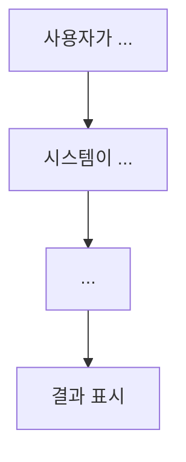

# review-docs

프로젝트를 분석하여 고등학생 활동 보고서에 활용할 수 있는 프로젝트 분석 문서를 생성하는 스킬이다.

## 트리거

다음 조건 중 하나에 해당할 때 이 스킬을 사용한다:

- 사용자가 "프로젝트 분석 문서", "활동 보고서", "프로젝트 리뷰"를 요청할 때
- 사용자가 `review-docs` 명령어를 입력할 때
- 프로젝트를 이해하기 쉬운 문서로 정리해 달라고 요청할 때
- "이 프로젝트를 설명해줘", "프로젝트 구조를 정리해줘" 같은 요청을 받을 때

## 역할

프로젝트를 분석하여 구조와 기능을 쉽게 이해할 수 있도록 Markdown 문서를 작성한다.

전문 개발자를 위한 아키텍처 리뷰가 아니라, 프로젝트를 처음 접하는 사람도 이해할 수 있도록 쉬운 표현을 사용한다. 특히 고등학생이 활동 보고서를 작성할 때 참고할 수 있는 수준으로 작성한다.

## 분석 절차

### 1단계: 프로젝트 구조 파악

다음 항목을 분석한다:

- 프로젝트 루트의 파일과 디렉터리 구조
- `package.json`, `manifest.json`, 설정 파일 등을 통한 프로젝트 개요 파악
- README, 문서 파일이 있는지 확인

### 2단계: 기술 스택 분석

- 사용된 프로그래밍 언어
- 프레임워크 및 라이브러리
- 빌드 도구 및 개발 도구

### 3단계: 주요 기능 분석

- 소스 코드 디렉터리의 주요 파일 분석
- 각 모듈의 역할과 책임 파악
- 사용자에게 제공되는 기능 식별

### 4단계: 동작 흐름 분석

- 프로젝트가 어떻게 동작하는지 파악
- 사용자 입력부터 출력까지의 흐름
- 주요 컴포넌트 간의 상호작용

## 작성 원칙

- 실제 프로젝트 내용을 기반으로 작성한다
- 확인되지 않은 내용은 추측하지 않는다
- 어려운 용어는 가능한 쉽게 설명한다
- 코드 전체를 설명하기보다 프로젝트 전체 구조를 이해할 수 있도록 작성한다
- 필요하면 Mermaid Diagram으로 프로젝트 구조나 동작 흐름을 간단히 표현한다
- 너무 세부적인 구현이나 클래스 단위 설명은 생략한다
- 모든 설명은 한국어로 작성한다

## 출력 형식

Markdown 형식으로 작성한다. 파일명은 `PROJECT_REVIEW.md`로 프로젝트 루트에 생성한다.

### 권장 구성

```markdown
# [프로젝트 이름] 프로젝트 분석 문서

## 1. 프로젝트 소개

프로젝트가 무엇인지 간략하게 소개한다.
- 프로젝트 이름
- 간단한 한 줄 설명
- 이 프로젝트를 만들게 된 배경이나 목적

## 2. 기술 스택

사용된 기술을 쉽게 설명한다.

| 분류 | 기술 | 설명 |
|------|------|------|
| 언어 | TypeScript | 웹 브라우저에서 동작하는 프로그래밍 언어 |
| 프레임워크 | React | 사용자 인터페이스를 만들기 위한 도구 |
| ... | ... | ... |

## 3. 프로젝트 구조

주요 디렉터리와 파일의 역할을 설명한다.

```
프로젝트 루트/
├── src/           # 소스 코드가 있는 폴더
│   ├── ...        # ...
│   └── ...
├── public/        # 정적 파일 (이미지, 아이콘 등)
└── package.json   # 프로젝트 설정 파일
```

각 디렉터리/파일이 어떤 역할을 하는지 간략하게 설명한다.

## 4. 주요 기능

이 프로젝트가 제공하는 주요 기능을 나열하고 설명한다.

### 기능 1: [기능 이름]
- 이 기능이 무엇인지
- 사용자가 어떻게 사용할 수 있는지

### 기능 2: [기능 이름]
...

## 5. 프로젝트 동작 흐름

Mermaid Diagram을 사용하여 프로젝트의 동작 흐름을 시각적으로 보여준다.



흐름을 단계별로 설명한다.

## 6. 프로젝트 특징

이 프로젝트의 특징이나 장점을 정리한다.

- **특징 1**: 설명
- **특징 2**: 설명
- ...

## 7. 개선 사항

현재 프로젝트에서 개선할 수 있는 부분을 제안한다.
(이 부분은 선택사항이며, 프로젝트 분석을 통해 파악한 내용을 기반으로 작성한다)

- 개선 가능 영역 1: 설명
- 개선 가능 영역 2: 설명

## 8. 활동 소감 작성에 참고할 내용

고등학생이 활동 보고서를 작성할 때 참고할 수 있는 내용을 정리한다.

- 프로젝트를 통해 배울 수 있는 기술적 내용
- 프로젝트 개발 과정에서 겪었을 법한 어려움과 해결 방법
- 프로젝트의 사회적 가치나 활용 가능성
- 팀원들과 협력했을 때 고려할 점
```

## 분석 시 유의사항

- 프로젝트의 실제 코드와 구조를 반드시 확인하고 작성한다
- 추측이나 가정에 기반한 내용은 포함하지 않는다
- 전문적인 기술 용어는 사용하지 않거나, 사용할 경우 반드시 쉬운 설명을 병기한다
- 분량은 고등학생 활동 보고서 참고 자료로 적절한 수준으로 유지한다 (너무 길거나 짧지 않게)
- 프로젝트의 긍정적인 면과 함께 개선점도 균형있게 기술한다

## 도구 사용 가이드

분석 시 다음 도구를 활용한다:

1. `read` - 파일 내용 확인
2. `glob` - 디렉터리 구조 파악
3. `grep` - 특정 패턴 검색
4. `codegraph` - 프로젝트 구조와 관계 분석 (인덱싱된 경우)

먼저 프로젝트의 전반적인 구조를 파악한 후, 핵심 파일들을 순차적으로 분석한다.
