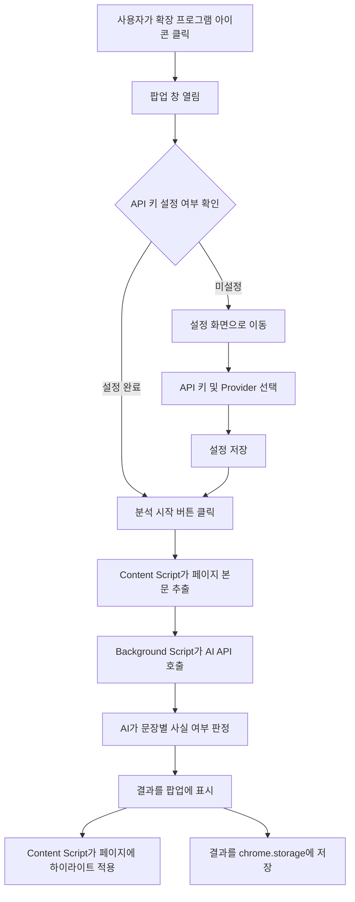

# Web Fact Checker 프로젝트 분석 문서

## 1. 프로젝트 소개

- **프로젝트 이름**: Web Fact Checker (웹 팩트체크 확장 프로그램)
- **한 줄 설명**: 웹 페이지의 콘텐츠를 분석하여 사실 여부를 검증하는 Chrome 확장 프로그램
- **배경/목적**: 인터넷에서 접하는 정보의 신뢰도를 확인할 수 있는 도구를 만들기 위해 개발됨. AI 기술을 활용하여 문장별 사실 여부를 판정하고, 사용자가 뉴스나 기사를 읽을 때 가짜 뉴스나 허위 정보를 걸러내는 데 도움을 줌

## 2. 기술 스택

| 분류 | 기술 | 설명 |
|------|------|------|
| 언어 | TypeScript | 웹 브라우저에서 동작하는 프로그래밍 언어. JavaScript에 타입 안전성을 추가한 언어 |
| 확장 프로그램 | Chrome Extension Manifest V3 | Chrome 브라우저 확장 프로그램을 만들기 위한 최신 표준 |
| 빌드 도구 | Vite | 빠르고 간단한 웹 개발 서버 및 빌드 도구 |
| 빌드 플러그인 | @crxjs/vite-plugin | Chrome 확장 프로그램을 Vite로 빌드할 수 있게 해주는 도구 |
| UI 프레임워크 | Pico CSS | 가볍고 간단한 CSS 프레임워크. 클래스 없이 깔끔한 UI를 만들 수 있음 |
| 본문 추출 | @mozilla/readability | 웹 페이지에서 본문만 깔끔하게 추출하는 라이브러리 |
| 스토리지 | chrome.storage.local | Chrome 확장 프로그램 전용 로컬 저장소 |
| AI 서비스 | OpenAI / Claude / Gemini | 다양한 AI 모델을 선택하여 사용할 수 있는 외부 API |

## 3. 프로젝트 구조

```
web-fact-checker-extension-main/
├── src/                      # 소스 코드가 있는 폴더
│   ├── background.ts         # Service Worker - 메시지 라우팅, AI 호출 담당
│   ├── content.ts            # Content Script - 웹 페이지 본문 추출, 하이라이트
│   ├── popup/                # 팝업 UI (사용자가 보는 화면)
│   │   ├── index.html        # 팝업 메인 HTML
│   │   ├── main.ts           # 뷰 전환 로직
│   │   ├── styles.css        # 스타일 시트
│   │   ├── views/            # 각 화면별 뷰
│   │   │   ├── analyze-view.ts   # 분석 화면
│   │   │   ├── history-view.ts   # 분석 내역 화면
│   │   │   └── settings-view.ts  # 설정 화면
│   │   └── components/       # 재사용 가능한 UI 컴포넌트
│   │       ├── provider-selector.ts  # AI Provider 선택 컴포넌트
│   │       ├── score-badge.ts        # 신뢰도 점수 배지
│   │       └── result-card.ts        # 분석 결과 카드
│   ├── core/                 # 공통 타입, 상수, 메시지 프로토콜
│   │   ├── types.ts          # TypeScript 타입 정의
│   │   ├── messages.ts       # 컴포넌트 간 메시지 타입
│   │   └── constants.ts      # 상수 설정값
│   ├── analysis/             # 분석 엔진, AI Provider 어댑터
│   │   ├── analyzer.ts       # 분석 메인 로직
│   │   └── providers/        # AI Provider별 구현
│   │       ├── interface.ts  # Provider 인터페이스
│   │       ├── openai.ts     # OpenAI API 연동
│   │       ├── claude.ts     # Claude API 연동
│   │       └── gemini.ts     # Gemini API 연동
│   └── storage/              # chrome.storage.local 데이터 계층
│       ├── settings-store.ts # 설정 저장/로드
│       └── history-store.ts  # 분석 내역 저장/로드
├── manifest.json             # Chrome 확장 프로그램 설정 파일
├── package.json              # Node.js 프로젝트 설정
├── tsconfig.json             # TypeScript 설정
├── vite.config.ts            # Vite 빌드 설정
└── README.md                 # 프로젝트 설명 문서
```

## 4. 주요 기능

### 기능 1: 웹 페이지 본문 분석
- 방문 중인 웹 페이지의 주요 콘텐츠를 자동으로 추출
- Readability 기술을 사용하여 광고, 메뉴 등 불필요한 요소를 제거하고 본문만 선별

### 기능 2: AI 기반 팩트체크
- OpenAI, Claude, Gemini 중 선택한 AI 모델을 사용하여 문장별 사실 여부 판정
- 각 문장에 대해 0.0~1.0 사이의 신뢰도 점수와 6단계 레이블(true, mostly_true, unverified, mostly_false, false, opinion)을 부여

### 기능 3: 실시간 하이라이트 표시
- 분석 완료 후 웹 페이지에서 해당 문장을 색상으로 강조 표시
- 점수에 따라 초록(신뢰도 높음) → 노란색(보통) → 빨간색(신뢰도 낮음)으로 색상 구분

### 기능 4: 분석 내역 관리
- 이전 분석 결과를 자동으로 저장
- 최대 50개까지 내역 보관
- 언제든 과거 분석 결과를 다시 확인 가능

### 기능 5: 결과 내보내기
- 분석 결과를 JSON 또는 텍스트 파일로 내보내기
- 보고서 작성이나 데이터 분석에 활용 가능

### 기능 6: 다중 AI Provider 지원
- OpenAI, Claude, Gemini 중 사용자가 원하는 AI 서비스 선택 가능
- 각 Provider별로 여러 모델 선택 가능

## 5. 프로젝트 동작 흐름



### 상세 흐름 설명

1. **사용자가 확장 프로그램 아이콘을 클릭**하면 팝업 창이 열립니다
2. **팝업은 설정 화면에서 API 키와 AI Provider를 선택**하도록 안내합니다
3. **"분석 시작" 버튼을 클릭**하면 분석이 시작됩니다
4. **Content Script(콘텐츠 스크립트)**가 현재 웹 페이지의 본문 텍스트를 추출합니다
5. **Background Script(배경 스크립트)**가 추출된 텍스트를 선택한 AI API로 전송합니다
6. **AI가 각 문장의 사실 여부를 분석**하여 신뢰도 점수와 레이블을 반환합니다
7. **결과가 팝업 화면에 표시**되고, 동시에 웹 페이지에서 해당 문장들이 색상으로 강조됩니다
8. **분석 결과는 자동으로 저장**되어 언제든 다시 확인할 수 있습니다

## 6. 프로젝트 특징

- **모듈화된 아키텍처**: 기능별로 폴더와 파일을 체계적으로 분리하여 유지보수가 용이
- **Provider 패턴**: AI 서비스를 쉽게 추가/변경할 수 있는 인터페이스 기반 설계
- **사용자 친화적 UI**: Pico CSS를 활용한 깔끔하고 직관적인 인터페이스
- **에러 핸들링**: API 오류, 네트워크 문제 등 다양한 예외 상황에 대한 사용자 친화적 메시지
- **한국어 지원**: 모든 UI 텍스트와 에러 메시지가 한국어로 작성됨
- **安全性**: API 키는 로컬 스토리지에만 저장되며 외부로 전송되지 않음

## 7. 개선 사항

- **다국어 지원**: 현재 한국어만 지원하므로, 다국어 지원을 추가하면 글로벌 사용자 확보 가능
- **사용자 정의 프롬프트**: AI에게 전달하는 분석 프롬프트를 사용자가 직접 수정할 수 있는 기능
- **일괄 분석**: 여러 페이지를 한 번에 분석하는 기능
- **시각적 차트**: 분석 결과를 그래프나 차트로 시각화하는 기능
- **브라우저 동기화**: 여러 기기 간에 설정과 분석 내역을 동기화하는 기능
- **오프라인 지원**: 네트워크 연결 없이도 기본적인 분석이 가능한 기능

## 8. 활동 소감 작성에 참고할 내용

### 프로젝트를 통해 배울 수 있는 기술적 내용
- Chrome 확장 프로그램의 구조 (Manifest V3, Service Worker, Content Script)
- AI API 연동 방법 (OpenAI, Claude, Gemini)
- TypeScript를 활용한 타입 안전한 프로그래밍
- 비동기 프로그래밍 (async/await, Promise)
- 로컬 스토리지를 활용한 데이터 영속화

### 프로젝트 개발 과정에서 겪었을 법한 어려움과 해결 방법
- **Chrome 확장 프로그램의 보안 제한**: Content Script와 Background Script 간의 통신이 제한적 → 메시지 프로토콜을 통해 해결
- **AI API 응답 처리**: AI 모델의 응답이 예상과 다를 수 있음 → 정규 표현식과 JSON 파싱을 통해 안정적으로 처리
- **웹 페이지 본문 추출**: 광고, 메뉴 등 불필요한 요소가 섞임 → Readability 라이브러리로 본문만 선별
- **여러 AI 서비스 통합**: 각 서비스의 API 형식이 다름 → 인터페이스 기반 설계로 통일된 방식 처리

### 프로젝트의 사회적 가치나 활용 가능성
- **가짜 뉴스 방지**: AI를 활용하여 뉴스나 기사의 신뢰도를 객관적으로 판단
- **미디어 리터러시 교육**: 학생들이 정보의 진위를 판단하는 능력 향상
- **연구 자료**: 언론학, 사회학 연구에서 뉴스 분석 자료로 활용 가능
- **기업용**: 기업에서 뉴스 모니터링, 브랜드 리스크 관리에 활용 가능

### 팀원들과 협력했을 때 고려할 점
- **명확한 역할 분담**: 프론트엔드(UI), 백엔드(API 연동), 데이터 분석 등 역할을 명확히 구분
- **코드 리뷰**: TypeScript의 타입 시스템을 활용하여 코드 품질 유지
- **버전 관리**: Git을 활용한 체계적인 버전 관리와 브랜치 전략
- **문서화**: API 명세, 컴포넌트 설명 등 체계적인 문서 작성
